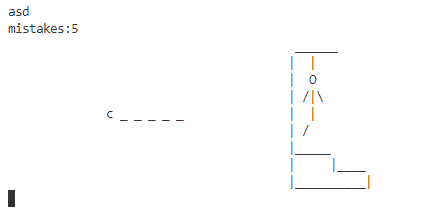
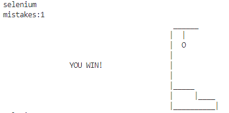
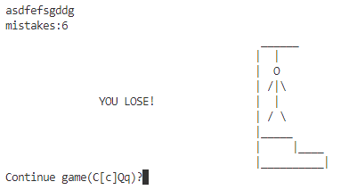
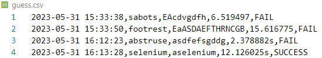

# Hang-Man-Game

# 1 项目目录

- __init__.py
- game.py
- hangmanlib.py
- guess.csv
- words.txt
# 2 开发及运行环境
Python 3.9.6
# 3 运行及使用方法
`python -u "game.py"`
# 4 文件功能介绍
## game.py
实现游戏的功能
## hangmanlib.py
实现绘制小人的函数
## guess.csv
记录游戏过程的信息
## words.txt
提供的单词表

# 5 代码特点
## 面向对象编程
### 对象及其功能
Player类：面向玩家，处理输入
Computer类：面向电脑，生成单词，判断玩家输入，判断游戏结果
Log类：记录游戏的信息
Game类：组织其他三个类，提供输入接口，展示游戏画面，实现游戏的流程
### 设计理念

1. 使用类似MVC的设计模式，将游戏画面的展示，数据的更新，状态的判定等功能解耦合
2. 低耦合高内聚，各个类都有自己明确的功能
3. 保证类的封装性，只能通过类的公共接口访问数据

## 整体代码风格

1. 使用函数封装代码，使得代码的可读性较强
2. 具有强好的鲁棒性，对于非法输入都有相应的处理策略

# 6 整体实现思路
## 核心函数

## 解释

1. 首先构造Player，Computer，Log类
2. 核心函数play()中，外层循环表示每一次游戏，内层循环表示每一次玩家输入
3. 在单词游戏开始时，调用日志函数，展示游戏画面
4. 在每次输入前，判断游戏状态，若为"RUNNING"，说明游戏未结束
5. 调用player的成员函数获取玩家输入
6. 调用computer的成员函数判断用户输入，并更新游戏状态
7. 更新游戏画面
8. 判断游戏状态，若为"SUCCESS"或者“FAIL”，说明游戏结束，跳出内层循环，记录游戏信息，询问玩家退出还是继续
9. 若玩家选择继续，则重置player，computer，游戏状态，若玩家选择退出，则游戏结束
10. 游戏结束后，可以在guess.csv中查看游戏信息日志
# 7 实现细节（优点）

1. 日志类只在构造的的时候打开文件，只在析构的时候关闭文件，这可以减少时间开销，同时保证文件不会因为程序的意外中断而导致为关闭
2. 使用os.system('cls')函数，在每次数据更新后清空终端输出，使得游戏过程更加流畅舒适

# 8 一些文档中未写明的功能的定义

1. 忽略任意的非法字符输入
2. 如果重复输入某个单词中存在的字符则忽略
3. 如果重复输入某个单词中不存在的字符则mistakes次数加一
4. guess.csv文件只记录合法字符输入，并且记录多余输入的合法字符
5. 只展示输入的合法字符
6. 如果一次性输入多个字符，则一次性更新游戏画面以及游戏状态

# 9 项目截图
## 游戏中

## 游戏胜利

## 游戏失败

## 日志

